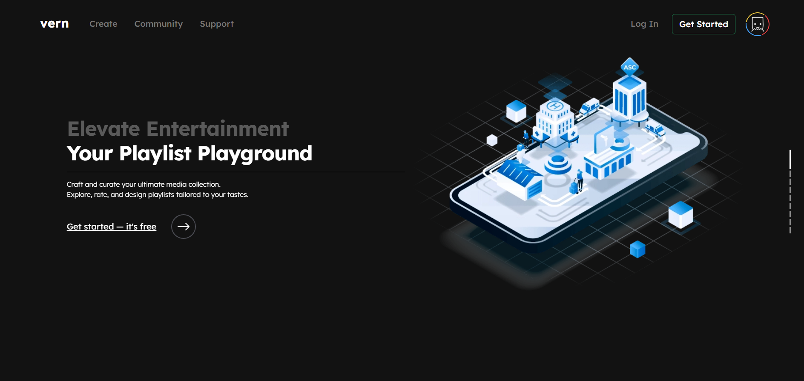
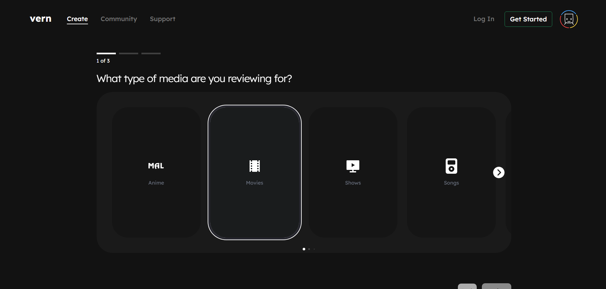

# Reviews Hub – Media Review Concept App

⚠️ **Disclaimer:** This project was primarily a **testbed** for learning new technologies (Next.js, TypeScript, CSS Modules, etc.) and experimenting with frontend concepts. It is **not a production-ready reviews platform**, but rather a proof-of-concept to practice building out UI, state management, and feature workflows.

A media review site prototype where users can create accounts, explore media, and draft playlists/reviews.  
More of a **concept app** than a polished product, but it served as an important first step in building my frontend skillset.

## 🌐 Prototype Preview

[job-board-rho-one.vercel.app/jobs](https://vernacular-ruddy.vercel.app/)


## ✨ Features (Conceptual)

- **User Accounts** – mock authentication and account creation flow
- **Playlists** – organize movies, TV, books, or games into collections
- **Reviews & Ratings** – leave simple reviews tied to playlists
- **Explore Mode** – browse shared playlists for discovery
- **Basic UI/UX Flows** – built to test frontend patterns, not full functionality


## 📸 Screenshots



_Vern landing page._

<br />



_Vern creation feature._


## 🛠️ Tech Stack

- **Framework:** Next.js
- **Frontend:** React, TypeScript, CSS Modules, Bootstrap 5
- **Utilities:** Lodash, React Query, classNames
- **Deployment:** Vercel (frontend)


## 🚀 Getting Started

Clone the repo and install dependencies:

```bash
git clone https://github.com/yourusername/vern.git
cd vern
npm install
npm run dev
```

## 📄 Status
This was a first-time experiment with the stack.
The codebase demonstrates early frontend skills but is not actively maintained.

## ❓ FAQ

**Why is it called “vern”?**  
The name “vern” was chosen simply as a creative identifier. It was inspired by a character reference from a television show and selected because it felt distinctive, simple, and memorable.